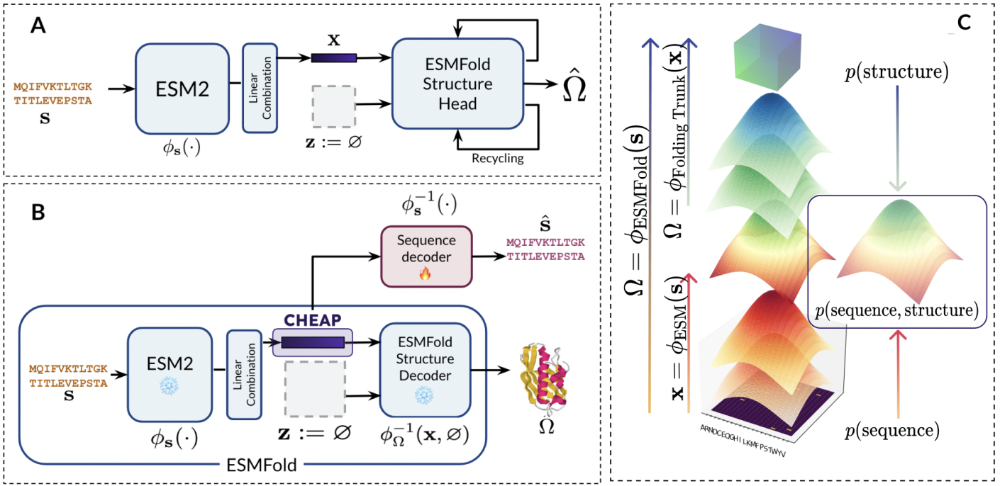

# CHEAP (Compressed Hourglass Embedding Adaptation of Proteins)

Code for [Tokenized and Continuous Embedding Compressions of Protein Sequence and Structure](https://www.biorxiv.org/content/10.1101/2024.08.06.606920v1).




## Table of Contents

1. [Demo](#demo)
2. [Installation](#installation)
    - [Caching weights and auxiliary tensors](#caching-weights-and-auxiliary-tensors)
3. [Usage](#usage)
    - [Example](#example)
    - [Available Models](#available-models)
4. [Configuration](#configuration)
5. [Citation](#citation)


## Demo
For a demo of reported results, including phenomena of massive activations in [ESMFold (Lin et al.)](https://www.science.org/doi/10.1126/science.ade2574), see `notebooks/cheap_example.ipynb`.

## Installation

Clone the repository:

```
git clone https://github.com/amyxlu/cheap-proteins.git
cd cheap-proteins
```

To create the environment for the repository:
```
conda env create --file environment.yaml
pip install --no-deps git+https://github.com/amyxlu/openfold.git  # see note below
pip install -e .
```


>[!NOTE]
>The ESMFold structure module use the OpenFold implementation, which includes custom CUDA kernels for the attention mechanism. Installing using the instructions here will automatically install an OpenFold [fork]() in no-dependency mode, which includes some minor changes to use C++17 instead of C++14 to build the CUDA kernels, for compatibility with `torch >= 2.0`.


### Caching weights and auxiliary tensors
To use the model for inference, several cached tensors are needed to normalize by channel and bypass massive activations explored in the paper. By default, the files will be downloaded to `~/.cache/cheap`. However, since these files can be large, you can override by setting the `CHEAP_CACHE` environment variable:

```
echo "export CHEAP_CACHE=/data/lux70/cheap" >> ~/.bashrc
```

>[!NOTE]
>Each checkpoint is around 1GB. If you intend to download all 17 models, it is recommended to set `CHEAP_CACHE` if your shared cluster is limited on home directory space.

You can also change where files are downloaded by modifying the variables in `src/cheap/constants.py`.

## Usage

### Example

To obtain compressed representations of sequences, you can use this example (also see notebook example at `notebooks/usage_example.ipynb`). **Model weights will be automatically downloaded to `~/.cache/cheap`, or `CHEAP_CACHE` if the environment variable is set.**

```
import torch
device = torch.device("cuda")

# replace with shorten factor and dimension of choice
from cheap.pretrained import CHEAP_shorten_1_dim_64
pipeline = CHEAP_shorten_1_dim_64(return_pipeline=True)

# sample sequences
# note: returned representation will be padded to the length of the longest sequence
# consider cropping the sequences beforehand if memory is an issue.

sequences = [
    # >cath|current|12asA00/4-330
    "AYIAKQRQISFVKSHFSRQLEERLGLIEVQAPILSRVGDGTQDNLSGAEKAVQVKVKALPDAQFEVVHSLAKWKRQTLGQHDFSAGEGLYTHMKALRPDEDRLSPLHSVYVDQWDWERVMGDGERQFSTLKSTVEAIWAGIKATEAAVSEEFGLAPFLPDQIHFVHSQELLSRYPDLDAKGRERAIAKDLGAVFLVGIGGKLSDGHRHDVRAPDYDDWSTPSELGHAGLNGDILVWNPVLEDAFELSSMGIRVDADTLKHQLALTGDEDRLELEWHQALLRGEMPQTIGGGIGQSRLTMLLLQLPHIGQVQAGVWPAAV",
    # >cath|current|132lA00/2-129
    "VFGRCELAAAMRHGLDNYRGYSLGNWVCAAFESNFNTQATNRNTDGSTDYGILQINSRWWCNDGRTPGSRNLCNIPCSALLSSDITASVNCAKIVSDGNGMNAWVAWRNRCGTDVQAWIRGCRL",
    # >cath|current|153lA00/1-185
    "RTDCYGNVNRIDTTGASCKTAKPEGLSYCGVSASKKIAERDLQAMDRYKTIIKKVGEKLCVEPAVIAGIISRESHAGKVLKNGWGDRGNGFGLMQVDKRSHKPQGTWNGEVHITQGTTILINFIKTIQKKFPSWTKDQQLKGGISAYNAGAGNVRSYARMDIGTTHDDYANDVVARAQYYKQHGY",
]

emb, mask = pipeline(sequences)
```

### Available Models
To assess the effects of gradual compression, the following models are available, all trained on [CATH](https://cathdb.info/). All can be imported from `cheap.pretrained`.

* `CHEAP_shorten_1_dim_1024()`
* `CHEAP_shorten_1_dim_512()`
* `CHEAP_shorten_1_dim_256()`
* `CHEAP_shorten_1_dim_128()`
* `CHEAP_shorten_1_dim_64()`
* `CHEAP_shorten_1_dim_32()`
* `CHEAP_shorten_1_dim_16()`
* `CHEAP_shorten_1_dim_8()`
* `CHEAP_shorten_1_dim_4()`
* `CHEAP_shorten_2_dim_1024()`
* `CHEAP_shorten_2_dim_512()`
* `CHEAP_shorten_2_dim_256()`
* `CHEAP_shorten_2_dim_128()`
* `CHEAP_shorten_2_dim_64()`
* `CHEAP_shorten_2_dim_32()`
* `CHEAP_shorten_2_dim_16()`
* `CHEAP_shorten_2_dim_8()`
* `CHEAP_shorten_2_dim_4()`

Note that there is no model for `shorten_1_dim_1024`; this is equivalent to the original model ESMFold model. To obtain the embedding at the layer that we describe in the paper, you can use:

```
from cheap.esmfold import esmfold_v1_embed_only
model = esmfold_v1_embed_only()  # does not include the structure module.
```

We also make available a model trained on Pfam:
* `CHEAP_pfam_shorten_2_dim_32()`


### Configuration

For more advanced usage, see the configurations in `configs`. We make use of [Hydra]() for flexible and modular configuration. Be sure to first set the paths in `configs/paths.yaml` to the corresponding paths on your machine.


## Citation

If this code is useful in your work, please use the citation:

```
@article{lu2024tokenized,
  title={Tokenized and Continuous Embedding Compressions of Protein Sequence and Structure},
  author={Lu, Amy X and Yan, Wilson and Yang, Kevin K and Gligorijevic, Vladimir and Cho, Kyunghyun and Abbeel, Pieter and Bonneau, Richard and Frey, Nathan},
  journal={bioRxiv},
  pages={2024--08},
  year={2024},
  publisher={Cold Spring Harbor Laboratory}
}
```

Contact: amyxlu [at] berkeley [dot] edu OR lux70 [at] gene [dot] com.
